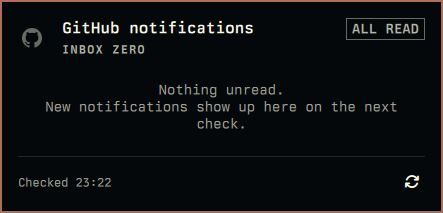
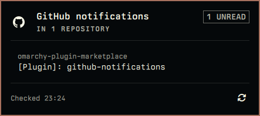

# GitHub Notifications

Your unread GitHub notifications, right in the Omarchy bar. When something is
waiting for you the GitHub mark lights up; when your inbox is quiet it dims.
Click the mark and a small panel drops down listing what's new, so you can see at
a glance whether anything needs your attention.

<table>
    <tr>
    <td></td>
    <td></td>
    </tr>
</table>

## Install

You need the GitHub CLI (`gh`) installed and signed in — the plugin reads your
notifications through it. Then run:

```bash
omarchy plugin add https://github.com/mrosati84/github-notifications.git --enable
```

The `--enable` flag does the extra step of adding the widget to your bar for you.
Without it the widget is installed but stays hidden until you enable it yourself,
either from the Settings panel or from your bar config.

For the commands below, the plugin's id is
`io.github.mrosati84.github-notifications`.

## Using it

Click the GitHub mark in the bar to open the notification list.

| Input        | What it does                                  |
| ------------ | --------------------------------------------- |
| Left click   | Open or close the notification list.          |
| Middle click | Check for new notifications right now.        |
| Right click  | Open github.com/notifications in your browser. |

Each row has two separate links: the repository name and the subject title.
Click either one and it opens in your browser, and the panel closes. To follow
the other link, click the GitHub mark in the bar to open the list again.

At the bottom of the panel, **Mark all read** marks every unread notification
read with a single `gh api --method PUT notifications` call and then refreshes
the list. There is no keyboard shortcut for it; `x` acts on the highlighted
notification alone.

### With the keyboard

| Key                   | What it does                                                  |
| --------------------- | ------------------------------------------------------------- |
| `↑` `↓` or `j` `k`    | Move the row cursor.                                          |
| `Enter` or `Space`    | Open the subject of the highlighted row; the panel closes.    |
| `o`                   | Open the repository of the highlighted row; the panel closes. |
| `x`                   | Mark the highlighted row done.                                |
| `r`                   | Refresh now.                                                  |
| `Esc`                 | Close the panel.                                              |

`x` marks one notification **done** — the same thing as dismissing it on
github.com/notifications — with a `DELETE notifications/threads/<id>` call, then
reloads the page you are on, so the row is gone and the next one moves up under
the cursor. Press it again to clear the next one. It acts on the row that is
highlighted, so with an empty list — or on a page you have just switched to,
where the cursor is dropped — it does nothing.

Hovering a row moves the same cursor, so the mouse and the keyboard always point
at one highlighted row.

### Opening it with a global keybinding

The panel is driven through the shell's IPC, so you can give it a Hyprland
keybinding and open it from anywhere. Add a line to
`~/.config/hypr/bindings.lua`:

```lua
o.bind("SUPER + SHIFT + I", "GitHub notifications",
  "omarchy-shell io.github.mrosati84.github-notifications toggle")
```

`toggle` opens the panel when it is closed and closes it when it is open; use
`open`, `close`, or `refresh` for a different action. Pick a key that is not
already taken (`omarchy menu keybindings --print` lists them), then apply it:

```bash
hyprctl reload && hyprctl configerrors
```

The binding works only while the widget is on your bar, because the bar widget
is what listens for the IPC command.

### Pages

Notifications are shown newest first, in pages of five. When there is more than
one page, a page control appears at the bottom of the panel:

- click a page number to jump straight to it;
- the left and right chevrons step one page at a time;
- `[` and `]` do the same from the keyboard.

## Settings

Settings live on the plugin's entry in `~/.config/omarchy/shell.json` or in the
Settings panel. Changes take effect right away — there is no need to restart the
shell.

| Setting           | Default | What it does                                                                                                       |
| ----------------- | ------- | ------------------------------------------------------------------------------------------------------------------ |
| `intervalSeconds` | `300`   | How often to check for new notifications, in seconds. Defaults to 5 minutes; values outside 60–3600 are clamped in. |
| `subjectLinks`    | `"web"` | Where the subject title opens. Leave it on `"web"`.                                                                 |

A settings snippet looks like this:

```json
{
  "id": "io.github.mrosati84.github-notifications",
  "intervalSeconds": 300,
  "subjectLinks": "web"
}
```

`subjectLinks` is the one setting worth a sentence. With `"web"` (the default,
and the recommended choice), clicking a subject opens the real GitHub web page.
With `"api"`, it opens the raw API address instead, which shows raw JSON — and a
404 for a private repository — and spends one of GitHub's limited unauthenticated
requests. For almost everyone, `"web"` is the right pick.

## Removal

Stop the widget and take it off the bar, while keeping it installed:

```bash
omarchy plugin disable io.github.mrosati84.github-notifications
```

Delete it completely, including its files:

```bash
omarchy plugin remove io.github.mrosati84.github-notifications
```

## For developers

The plugin is small. `Model.js` holds the pure logic (parsing, link rewriting,
failure text), `BarWidget.qml` polls and draws the bar mark, and `Panel.qml`
renders the popup and its pagination. `GitHubMark.qml` is the tinted mark.

Each fetch is deliberately bounded — one page of 5 notifications plus a one-item
`--include` probe for the exact unread total, both capped with `head -c` — so an
inbox of any size costs the same two reads. Only one fetch per instance is ever
in flight; an overlapping check is skipped. `gh` is reached through `bash -lc`,
so the login-shell `PATH` applies. The panel's **Mark all read** button makes
one `gh api --method PUT notifications` call to mark every unread notification
read, then refreshes the list; it has no key binding. `x` is the per-row action:
it sends one `DELETE notifications/threads/<id>` (GitHub's "mark a thread as
done") and then reloads the page in view. It comes from the shell kit's
`PanelKeyCatcher`, which turns `x`/`X` into `deleteRequested` before any
`textKey` handler sees it, so it is hardcoded on purpose and appears in no
setting.

IPC commands:

```bash
omarchy-shell io.github.mrosati84.github-notifications toggle
omarchy-shell io.github.mrosati84.github-notifications open
omarchy-shell io.github.mrosati84.github-notifications close
omarchy-shell io.github.mrosati84.github-notifications refresh
```

Testing:

```bash
node test-model.js
omarchy plugin validate .
```

`BarWidget.qml` and `Panel.qml` hot-reload when saved. `GitHubMark.qml` and
`assets/github.svg` do not — the QML type cache survives a plugin reload, so run
`omarchy restart shell` to pick up changes to those.

## License

MIT
